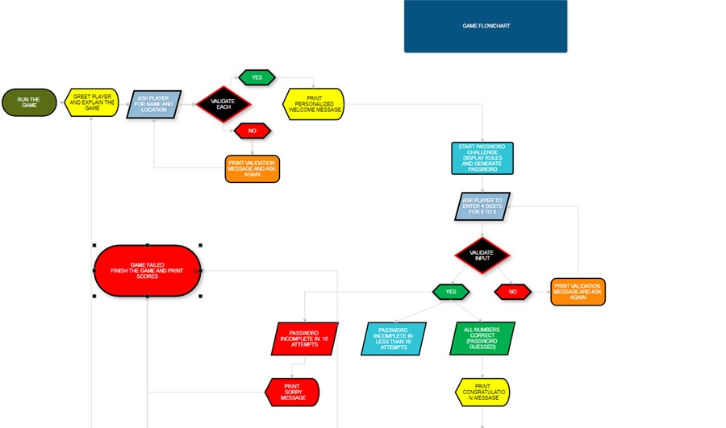
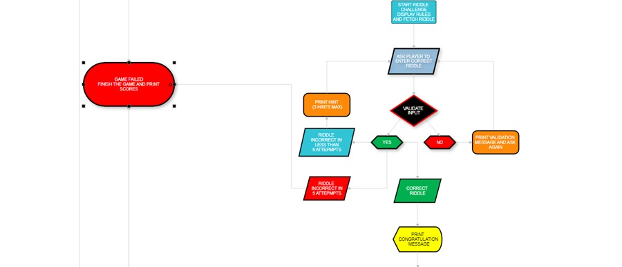
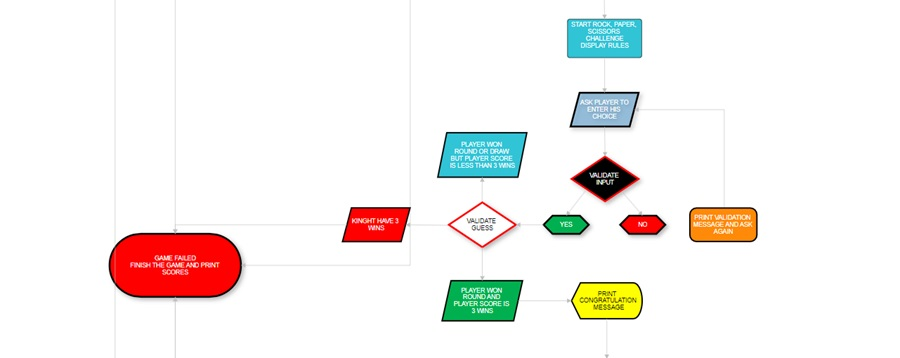
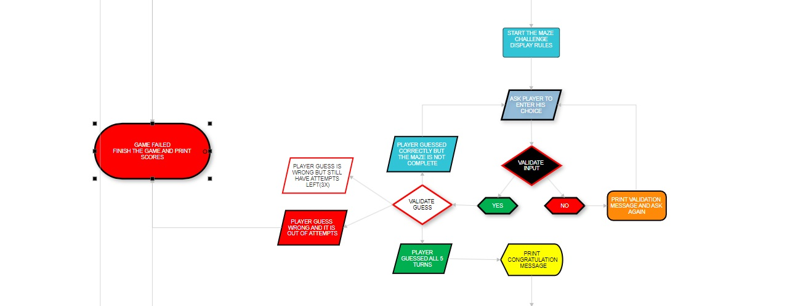
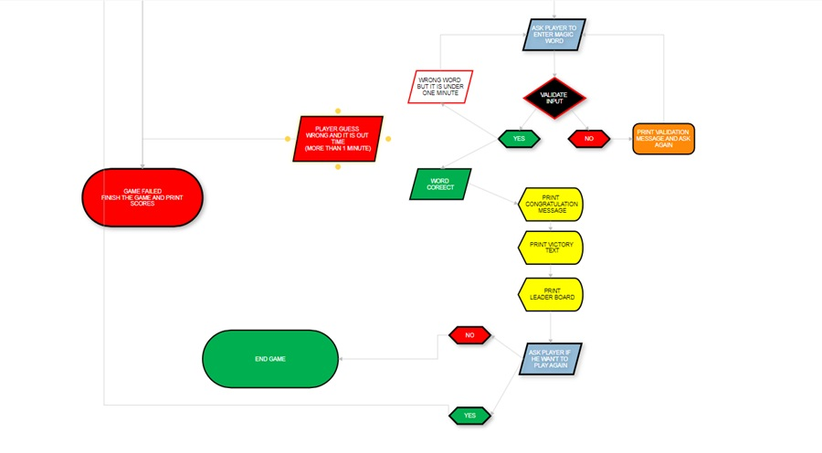
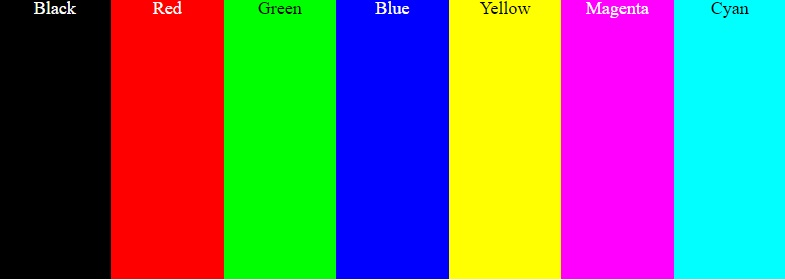
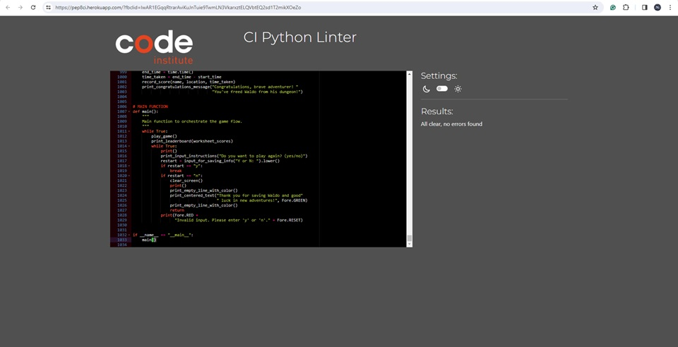

# Save Waldo: An Interactive Text Adventure Game

## Description

Welcome to Save Waldo, an interactive text-based adventure game where your mission is to rescue Waldo from his mysterious captivity. In this game, you'll encounter a series of challenges, including cracking passwords, solving riddles, and navigating through mazes. Each level presents a unique puzzle that you must overcome to progress and ultimately free Waldo from his confinement.

For an accessible version of the game, please visit [here](https://save-waldo-d25a8b526b3c.herokuapp.com/).

## User Experience (UX)

### Targeted Audience
Save Waldo is designed for players who enjoy challenging their logic, perception, and intelligence. It appeals to:

- **Puzzle Enthusiasts**: Engage in thought-provoking challenges designed to test your problem-solving skills.

- **Adventure Seekers**: Immerse yourself in an interactive text-based adventure that promises excitement at every turn.

- **Story Lovers**: Experience captivating storytelling intertwined with immersive gameplay, creating a truly unique narrative experience.

- **Mystery Solvers**: Uncover the secrets behind Waldo's captivity through clever problem-solving and keen observation.

- **Strategic Thinkers**: Strategize your moves to overcome obstacles and progress through challenging levels.

- **Curiosity Seekers**: Explore hidden clues and mysterious locations as you embark on a quest to free Waldo from captivity.

- **Riddle Enthusiasts**: Put your wit to the test with a variety of cryptic riddles waiting to be solved in Save Waldo.

# Flowchart Images

Here are the flowchart images for the Save Waldo game:

1. **Password and Start the Game Flowchart:**

2. **Riddle Level Flowchart:**

3. **Rock-Paper-Scissors Level Flowchart:**

4. **Word Maze Level Flowchart:**

5. **Magic Word Level And End Game Flowchart:**

## GOALS

### User Goals:

- **Logic Training**: Enhance logical thinking skills through puzzle-solving challenges.
  
- **Problem-Solving Practice**: Sharpen problem-solving abilities by tackling various obstacles.
  
- **Perception Improvement**: Improve perceptual skills by deciphering clues and patterns.
  
- **Critical Thinking Development**: Develop critical thinking skills through interactive storytelling.
  
- **Cognitive Engagement**: Engage in a mentally stimulating activity that exercises cognitive functions.
  
- **Entertainment and Enjoyment**: Experience fun and enjoyment while engaging in an immersive adventure.
  
- **Skill Progression**: Track and observe progression in logical, problem-solving, and perceptual abilities.
  
- **Interactive Learning**: Learn through interactive gameplay and narrative-driven challenges.
  
- **Sense of Achievement**: Feel a sense of accomplishment and fulfillment from overcoming challenges.
  
- **Relaxation and Stress Relief**: Enjoy a relaxing and stress-relieving gaming experience.

### Owner's Goals:

- **Provide Engaging Gameplay**: Offer players a captivating and immersive gaming experience.
  
- **Promote Critical Thinking**: Encourage players to develop and apply critical thinking skills.
  
- **Foster Problem-Solving Skills**: Create challenges that promote problem-solving and logical reasoning.
  
- **Ensure User Satisfaction**: Prioritize user satisfaction by delivering enjoyable and rewarding gameplay.
  
- **Build a Community**: Foster a community of players who share a passion for puzzle-solving and adventure.
  
- **Drive Engagement and Retention**: Keep players engaged and invested in the game through compelling content.
  
- **Encourage Continued Play**: Provide incentives and rewards to encourage players to continue playing and exploring.
  
- **Monetization Opportunities**: Explore monetization options such as in-game purchases or ad revenue while maintaining player satisfaction.

## Design

## Introduction
The `save-waldo` module contains functions related to the Save Waldo game, an interactive text-based adventure where players embark on a journey to rescue Waldo from his mysterious captivity. This README provides an overview of the module's functionalities, game mechanics, and design aspects.

### Design Goals
- Create an immersive and engaging text-based gaming experience.
- Incorporate interactive storytelling elements to captivate players' attention.
- Implement colorful and dynamic visualizations using the Colorama library to enhance the game's atmosphere.
- Integrate Google Sheets API for player information storage and leaderboard management.
- Utilize randomization and puzzle-solving mechanics to challenge players' logic and perception skills.
- Colorful text output and dynamic screen clearing to create an immersive gaming environment.

### User Interface
- **Colorful Output:** Utilization of Colorama library for colorful text output, enhancing visual appeal.
- **Interactive Prompts:** Informative prompts and instructions provided to guide players through the game.
- **Clearing Screen:** Functionality to clear the terminal screen for better readability and user experience.
- **Leaderboard Display:** Presentation of the leaderboard with player names, locations, and best times.

### Conclusion
The `save-waldo` module aims to deliver an immersive and challenging text-based adventure gaming experience. By combining interactive storytelling, puzzle-solving mechanics, and dynamic visual effects, the game seeks to captivate players and provide hours of entertainment.

## Game Features

### Personalized Adventure
- **Data Collection:** Before starting your adventure, provide your name and location for a personalized gaming experience.

### Multi-Level Challenge
- **Interactive Gameplay:** Engage in a multi-level game consisting of various challenges, each with its own unique objective.
- **Narrative-Driven Experience:** Immerse yourself in a captivating narrative-driven storyline as you progress through the levels.

### Diverse Challenges
- **Logic and Perception:** Test your logic and perception with challenging puzzles and mind-bending riddles.
- **Strategic Gameplay:** Employ strategic thinking and problem-solving skills to overcome obstacles and advance in the game.
- **Intellectual Challenges:** Confront intellectual challenges and solve puzzles to unlock new levels and progress in the game.

### Rewarding Progression
- **Scoring System:** Compete with friends and track your progress with a built-in scoring system.
- **Achievement Unlocks:** Unlock achievements and milestones as you progress through the game and complete challenges.
- **Personalized Experience:** Personalize your gaming experience with your name and location, stored securely to enhance immersion and engagement.

### Levels

#### Password Level
- **Objective:** Crack the lock to enter the castle and advance in your quest to save Waldo.
- **Challenge:** Guess the correct 4-digit password by using hints provided along the way.

#### Riddle Level
- **Objective:** Solve the mysterious riddle to uncover clues leading to Waldo's whereabouts.
- **Challenge:** Use your wit and intellect to decipher the enigmatic riddle and progress in the game.

#### Rock Paper Scissors Level
- **Objective:** Defeat the enchanted knight, All Mighty Paper O'Clipper, to proceed on your journey.
- **Challenge:** Engage in a battle of wits and strategy by playing rock, paper, scissors against the formidable knight.

#### Word Maze Level
- **Objective:** Navigate through the perplexing word maze to unveil the path to Waldo's captivity.
- **Challenge:** Traverse through a labyrinth of words, avoiding dead-ends and traps, to reach your destination.

#### Magic Word Level
- **Objective:** Discover the magic word that will unlock the cage holding Waldo prisoner.
- **Challenge:** Search for hidden clues and solve puzzles to uncover the elusive magic word and set Waldo free.

## Future Features

- **Expanded Gameplay:** Our team is dedicated to continuously improving the game experience. Expect updates and expansions that will introduce new levels, challenges, and features to keep the adventure fresh and exciting.

- **Community Engagement:** We value your feedback and input! Join our vibrant community to share your ideas, suggestions, and feedback. Together, we can shape the future of the game and create an even more immersive and enjoyable experience for all players.

- **Multiplayer Mode:** Challenge your friends or team up with other players in an exciting multiplayer mode. Compete against each other or collaborate to overcome obstacles and complete quests together.

- **Weekly Challenges:** Stay engaged and test your skills with weekly challenges that offer unique rewards and bonuses. Compete against other players on the leaderboard and earn special prizes for your achievements.

- **Interactive Events:** Participate in special in-game events that offer limited-time challenges, rewards, and exclusive content. Keep an eye out for announcements and join the fun!

### Technologies Utilized:
- **Paint (Windows):** Used the Paint application in Windows for basic image editing tasks, including creating and modifying images used in the game's user interface and graphics.
- **SmartDraw:** Employed [SmartDraw](https://app.smartdraw.com/) for creating flowcharts and diagrams to visualize game logic, level designs, and decision trees, enhancing development planning and organization.
- **ChatGPT:** Integrated ChatGPT for text generation and dialogue scripting, enabling dynamic and interactive storytelling elements within the game.
- **Python Standard Libraries:**
  - **shutil:** Utilized the shutil library for system-specific functions and terminal manipulation to enhance user experience and interface design.
  - **os:** Leveraged the os module for interacting with the operating system, facilitating file management and system calls necessary for game execution.
  - **random:** Used the random module to introduce randomness and variability into gameplay mechanics, such as generating random numbers and shuffling sequences.
  - **re:** Incorporated the re module for pattern matching and text processing tasks, enabling robust string manipulation capabilities within the game's logic.
  - **time:** Utilized the time module for time-related functionalities, including tracking gameplay events, implementing delays, and measuring performance metrics.

## Deployments

To deploy my application on Heroku, I followed these steps:

1. **Create a Heroku Account:** I signed up for a Heroku account on [Heroku's website](https://www.heroku.com/).

2. **Login to Heroku:** I
- logged in to my Heroku account.

3. **Prepared Application:**
- I ensured that my project was set up properly and contained all necessary files.
- I made sure that my project had a requirements.txt file containing all Python dependencies required for my application.

4. **Connect Heroku with GitHub:** I connected Heroku with my GitHub repository and set it up to automatically build and deploy my application whenever I push changes to GitHub.

5. **Set Up Config Vars:** I set up the necessary environment variables (Config Vars) for my application. I added these variables either through the Heroku dashboard or using the Heroku CLI:
- heroku config:set CREDS=<my-credentials>
- heroku config:set PORT=8000

6. **Add Buildpacks:** I specified the buildpacks required for my application. Since I'm using Python adn node.js, I needed to add the Python adn node.js buildpack. I did this through the Heroku dashboard:
- heroku/python
- heroku/nodejs

7. **Deployment Of Application:** With the automatic deployment set up, Heroku automatically built and deployed my application whenever I pushed changes to my GitHub repository.

8. **Accessing Application:** After a successful deployment, I could access my application by opening the URL provided by Heroku:

[Link To The Game](https://save-waldo-d25a8b526b3c.herokuapp.com/).

## Validation

To ensure adherence to Python's PEP 8 style guidelines, the Python code in this project was tested using the 
[CI Python Linter](https://pep8ci.herokuapp.com/?fbclid=IwAR1EGqqRtrarAviKuJnTuie9TwmLN3VkarxztELQVbtEQ2sd1T2mikXOeZo). 
The code was analyzed for compliance with PEP 8 standards, which cover aspects such as naming conventions, indentation, whitespace, and more.

The PEP 8 Online Checker detected any violations of the PEP 8 style guidelines and provided feedback on areas where improvements could be made. After reviewing the feedback, necessary adjustments were made to the code to ensure consistency and readability.

As a result, the Python code in this project aligns with PEP 8 standards, promoting maintainability and readability for developers.

